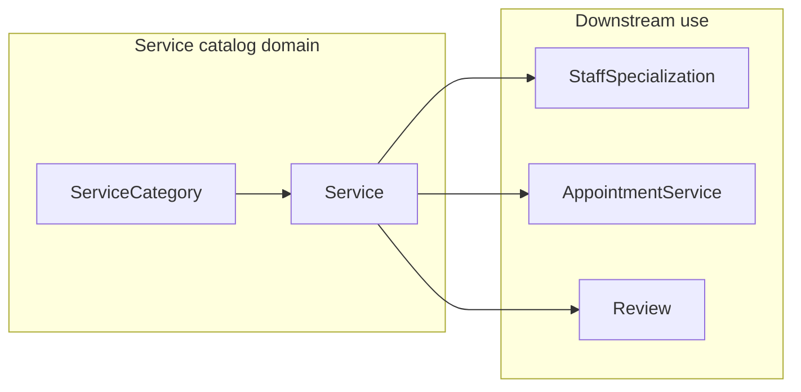

# Service catalog — function, build plan, and team brief

## Codebase overview (current state)

- **Stack:** Node.js, Express, Prisma (PostgreSQL), Zod validation, JWT bearer auth, Swagger in [d:\spa-management-system-be\swagger.js](d:\spa-management-system-be\swagger.js), routes mounted from [d:\spa-management-system-be\src\app.js](d:\spa-management-system-be\src\app.js).
- **Implemented today:** Auth and users only (`/auth`, `/users`). Patterns to copy: [d:\spa-management-system-be\src\routes\users.routes.js](d:\spa-management-system-be\src\routes\users.routes.js) (Swagger JSDoc + `validateBody` + `auth` / `requireRole`), controllers, and [d:\spa-management-system-be\src\middlewares\auth.middleware.js](d:\spa-management-system-be\src\middlewares\auth.middleware.js).
- **Data model already exists** (no new tables required for a basic catalog): `ServiceCategory`, `Service`, and `StaffSpecialization` in [d:\spa-management-system-be\prisma\schema.prisma](d:\spa-management-system-be\prisma\schema.prisma). Seed currently only creates an admin user ([d:\spa-management-system-be\prisma\seed.js](d:\spa-management-system-be\prisma\seed.js)); you will extend seed with sample categories/services (and ideally a staff user) for demos and CV screenshots.

---

## What “service catalog” means in this spa system

The **service catalog** is the master list of what the spa sells: **categories** (e.g. Massage, Facial) and **services** (each with duration, price, description, optional image, active flag). It is the source of truth for:

| Function                     | Description                                                                                                                                           |
| ---------------------------- | ----------------------------------------------------------------------------------------------------------------------------------------------------- |
| **Browse offerings**         | Customers (and staff) need a read-only view of active categories and services, often grouped by category, with optional search/filter.                |
| **Administer catalog**       | Admins create/update/delete (or soft-disable via `isActive`) categories and services so the business can change menu and pricing.                     |
| **Staff competency mapping** | `StaffSpecialization` links which staff can perform which service — required later for “pick a staff who can do this service” and for honest booking. |
| **Booking and billing**      | `AppointmentService` stores `priceSnapshot` and `durationMin` per line item so invoices stay correct even if catalog prices change later.             |

**Out of scope for catalog-only milestone:** appointment creation, payments, real file uploads. For a university demo, `imageUrl` can be an optional string (URL placeholder); production would use object storage later.

---

## API surface (recommended)

Align with the existing MVP doc ([d:\spa-management-system-becursor\plans\spa_backend_mvp_completion_d2488061.plan.md](d:\spa-management-system-be.cursor\plans\spa_backend_mvp_completion_d2488061.plan.md) Step 2):

**Service categories**

- `POST /service-categories` — ADMIN, create
- `GET /service-categories` — public or authenticated read; return active-only for public if you want a simple rule
- `GET /service-categories/:id` — detail + optional nested `services`
- `PATCH /service-categories/:id` — ADMIN
- `DELETE /service-categories/:id` — ADMIN (prefer **soft** conflict handling: block delete if services exist, or cascade policy documented)

**Services**

- `POST /services` — ADMIN
- `GET /services` — list with query params: `categoryId`, `isActive`, `q` (name search), pagination (`page`/`limit` or `cursor`)
- `GET /services/:id` — detail
- `PATCH /services/:id` — ADMIN
- `DELETE /services/:id` — ADMIN (same caution if referenced by appointments; uni project can forbid delete if `appointmentServices` exist)

**Staff specializations**

- `POST /staff/:staffId/specializations` — body `{ serviceId }`; ADMIN (optionally allow STAFF for **own** `staffId` only if you add a resolver from `req.user.id` → `Staff`)
- `DELETE /staff/:staffId/specializations/:serviceId` — ADMIN
- `GET /staff/:staffId/specializations` — useful for frontends listing what a staff member can do

**Authorization conventions**

- Reuse `auth` + `requireRole(['ADMIN'])` for mutations.
- Reads: either fully public (good for a marketing-style catalog) or `auth` optional; pick one and document in Swagger.

**Validation / errors**

- New file e.g. `src/validations/services.validation.js` with Zod schemas; use `validateBody` / query validation pattern from [d:\spa-management-system-be\src\validations\validate.js](d:\spa-management-system-be\src\validations\validate.js).
- Use `HttpError` from [d:\spa-management-system-be\src\utils\httpError.js](d:\spa-management-system-be\src\utils\httpError.js) for 404/409/403.

**Suggested new files** (same as MVP plan): controllers and routes for categories, services, specializations; one validation module; register routers in `createApp()`.

---

## What to use (tech and practices — CV-friendly, not overkill)

| Area          | Use                                                                                        |
| ------------- | ------------------------------------------------------------------------------------------ |
| Persistence   | Prisma Client; `include` / `select` for nested category ↔ services                         |
| API           | Express Router, JSON body, consistent JSON errors via existing `errorHandler`              |
| Validation    | Zod + existing `validateBody` (add query validation if needed)                             |
| Auth          | Bearer JWT; `requireRole` for admin writes                                                 |
| Docs          | Swagger JSDoc per route (same style as users routes)                                       |
| IDs           | Existing `cuid()` strings                                                                  |
| Money         | `Decimal` fields — serialize as strings in JSON to avoid float bugs                        |
| Testing       | Optional: 1–2 supertest smoke tests; manual Swagger try-it is enough for many uni projects |
| Team workflow | Short interface contract first (path, query, response shape), then parallel implementation |

---

## 4-person team plan — tasks and time estimates

Assumptions: **~6 productive hours/person/day**, familiar with repo, **2–3 day wall-clock** if you sync daily; **~1 week** if part-time. Estimates are **per person** where stated; parallel work reduces calendar time.

| Owner     | Task                            | Scope                                                                                                                                                        | Estimate                    |
| --------- | ------------------------------- | ------------------------------------------------------------------------------------------------------------------------------------------------------------ | --------------------------- |
| **Dev 1** | **Service categories**          | Routes + controller + Zod + Swagger; Prisma CRUD; sort by `sortOrder`                                                                                        | **6–10 h**                  |
| **Dev 2** | **Services**                    | CRUD + list filters + pagination + Swagger; validate `categoryId` exists; `Decimal` handling in responses                                                    | **12–18 h** (largest slice) |
| **Dev 3** | **Staff specializations**       | Link/unlink/list; verify `staffId` and `serviceId` exist; ADMIN-only; Swagger                                                                                | **6–10 h**                  |
| **Dev 4** | **Integration + seed + polish** | Mount routes in `app.js`; extend `seed.js` with categories, services, staff user + specializations; README snippet; fix merge conflicts; manual Swagger pass | **8–12 h**                  |

**Critical path:** Services (Dev 2) is longest; Dev 1 should finish category **create/list** early so Dev 2 can integration-test against real `categoryId`. Dev 3 can start with schema review and stubs, then wire after sample services exist.

**Suggested calendar (intensive sprint)**

- **Day 1 AM:** Whole team — agree response JSON shape, error codes, public vs protected reads, pagination defaults.
- **Day 1–2:** Dev 1 categories; Dev 2 services (parallel once POST category works); Dev 3 specializations; Dev 4 app wiring + seed in parallel.
- **Day 3:** Cross-review, Swagger polish, demo data, short “API demo” script for CV/portfolio.

**Person-total (rough):** ~~32–50 hours combined → with 4 people in parallel,~~ 2–3 focused days on the critical path is realistic.

---

## Definition of done (good enough for grades + CV)

- All catalog endpoints work against PostgreSQL with Prisma.
- Admin cannot create a service with invalid `categoryId` (clear 404/400).
- List endpoint supports filtering and stable ordering (e.g. category `sortOrder`, then service name).
- Swagger documents auth requirements accurately.
- Seed creates a believable mini catalog for demos.
- README or team wiki lists example calls (optional but strong for CV).

---

## Export this document for the team

**After you exit plan-only mode and approve implementation**, save the full content of this brief as a repo file so everyone can open it in Git, for example:

- **[d:\spa-management-system-be\docs\service-catalog-team-brief.md](d:\spa-management-system-be\docs\service-catalog-team-brief.md)** (create `docs/` if missing)

Copy the sections above into that file unchanged, or duplicate the plan file Cursor generates. The canonical technical reference for the wider MVP remains [d:\spa-management-system-becursor\plans\spa_backend_mvp_completion_d2488061.plan.md](d:\spa-management-system-be.cursor\plans\spa_backend_mvp_completion_d2488061.plan.md) Step 2.
